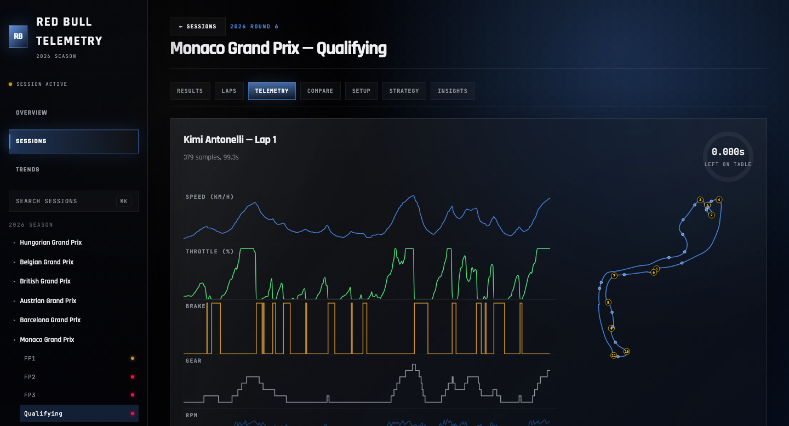

# Red Bull Telemetry — 2026 Season

**Live: [redbull-telemetry.vercel.app](https://redbull-telemetry.vercel.app)**

An F1 analytics dashboard built on real session data pulled from
[FastF1](https://docs.fastf1.dev) (the official F1 timing feed) rather than
synthetic data — every lap, sector, and telemetry trace in it happened in a
real (fictional 2026-season) session. Covers a full season's session
exploration, lap-by-lap pace analysis, telemetry visualization, lap
comparison, tire-strategy simulation, and a rule-based insights engine, all
themed in Red Bull Racing's actual 2026 livery colors. Fully public and
read-only — click the live link, no account needed.



## Features

- **Season Trends** — round-over-round finishing position, points, and tire
  degradation across the whole season, computed client-side from the same
  per-session data every other page uses.
- **Session Explorer** — every practice/qualifying/sprint/race session for
  every ingested weekend, with a command palette (`⌘K`) for jumping straight
  to one.
- **Results, Laps, Telemetry, Compare** — full classification with CSV
  export; lap-by-lap pace evolution with clean-lap detection; a synced
  multi-channel telemetry trace (speed/throttle/brake/gear/RPM/DRS) plotted
  alongside a track map with algorithmically detected corners (curvature
  analysis over consecutive position samples) and braking points; a
  side-by-side lap comparison tool with real telemetry overlays.
- **Setup** — tire compound pace and degradation by stint, color-coded to
  the real Pirelli compound convention, with per-stint lap-time sparklines
  and a Red-Bull-vs-field degradation comparison.
- **Strategy** — a "what if we'd pitted lap N instead" simulator: projects
  lap times outside the laps actually run using each stint's own fitted
  degradation trend, and is explicit about it — refuses to show a simulated
  number when a stint doesn't have enough clean laps to trust the trend,
  rather than presenting false precision.
- **Insights** — a small rule-based engine (stint degradation vs. the field,
  sector time vs. teammate, braking efficiency vs. teammate, pace
  consistency vs. teammate, time left on the table vs. the theoretical
  optimal lap) that flags real findings from the ingested data, not
  canned examples.
- Mobile-responsive throughout (off-canvas navigation, horizontally
  scrolling tables with sticky headers), and checked against WCAG AA
  contrast requirements.

## Architecture

```
FastF1 (live pull)
      │
      ▼
Python ingestion pipeline  ──▶  Postgres (Supabase)  ◀──  SQL analytics views
      │                              ▲                          │
      ▼                              │                          ▼
Cleaning pipeline            Python analytics service     React frontend
(data-quality flags)         (derived_metrics)             (Vite, Supabase JS)
```

- **Ingestion** (`ingest/`) — pulls a race weekend from FastF1, normalizes
  it into the relational schema, and writes it to Postgres idempotently
  (re-running a weekend replaces its rows rather than duplicating them).
  Supports tiered telemetry retention (full car/position telemetry for Red
  Bull's drivers and that session's closest rivals, results/laps/stints for
  everyone else) and a telemetry-skip mode for a cheap, broad season
  backfill — the two raw-telemetry tables are ~98% of this project's
  database size, so a full season only fits a free-tier storage budget by
  being deliberate about which sessions get full detail.
- **Cleaning** (`cleaning/`) — flags deleted/anomalous laps, safety-car and
  VSC periods, and incomplete sessions. Nothing is ever deleted from the
  raw data; every exclusion is a separate row with a stated reason.
- **SQL analytics layer** (`supabase/views.sql`) — lap-time evolution,
  stint performance, and compound comparisons as Postgres views, backed by
  a pandas reference implementation (`analytics/reference.py`) that the
  views are tested against for parity.
- **Analytics service** (`analytics/`) — the pieces that don't belong in
  SQL: optimal-lap estimation, stint degradation regression, a telemetry
  delta-time trace between two laps, and per-lap anomaly detection. Runs
  as a batch job and persists results to `derived_metrics`.
- **Insights engine** (`insights/`) — reads already-computed
  `derived_metrics`/laps/results back from Postgres and evaluates a small
  set of rule functions against them, writing findings to
  `insight_findings`. Adding a rule is "write a function, append it to a
  list" — the evaluation/persistence code doesn't change.
- **Frontend** (`src/`) — React 19 + Vite, querying Postgres directly
  through Supabase's PostgREST API using purpose-built, narrowly-scoped
  queries (never a raw telemetry dump).
- **Observability** (`observability/`, `src/lib/sentry.js`) — structured
  logging and optional Sentry reporting on both the Python pipeline and
  the frontend; both are no-ops when no Sentry DSN is configured.

See `docs/` for schema details, query performance notes, and the testing
strategy.

## Data model

Single-owner ingestion, public reads: every table hangs off `sessions` via
foreign key for provenance, but Postgres row-level security grants
unrestricted read access to everyone — there's nothing sensitive in a
season of F1 telemetry, so there's no login wall between the data and
anyone looking at it. Writes are a different story: only the ingestion
pipeline, authenticated with the Supabase `service_role` key, can write at
all. Telemetry and lap data are typed columns throughout (not JSON blobs)
— the schema is designed from the actual shape of FastF1's data, not
assumptions about it. See `docs/SCHEMA.md` for the full design rationale.

## Local development

Requires Node 22+, Python 3.11, Docker (for a local Supabase stack via the
Supabase CLI), and a FastF1-reachable network connection for ingestion.

```bash
# frontend
npm install
npm run dev

# python pipeline
python3.11 -m venv .venv
source .venv/bin/activate
pip install -r requirements.txt

# local Supabase stack (Postgres + PostgREST + Auth)
supabase start
```

Copy `.env.example` to `.env.local` and fill in the local (or hosted)
Supabase project's URL/anon key for the frontend, and `DATABASE_URL` /
`SUPABASE_OWNER_USER_ID` for the Python pipeline.

```bash
python scripts/ingest_weekend.py 2026 11      # pull + ingest one weekend
python scripts/ingest_season.py 2026          # pull + ingest every elapsed round
python scripts/clean_weekend.py 2026 11       # flag data-quality issues
python scripts/compute_derived_metrics.py 2026 11   # run the analytics service
python scripts/compute_insights.py 2026 11    # evaluate the insights engine
```

## Testing

```bash
npm test               # frontend unit tests
pytest tests/          # Python unit tests; DB-backed tests skip without DATABASE_URL
ruff check .           # Python lint
npm run lint            # frontend lint
```

See `docs/TESTING.md` for the full test strategy, including how RLS
policies and SQL/pandas parity are verified against a real database, and
`.github/workflows/ci.yml` for the CI pipeline.
